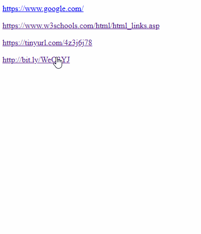

# Unshorten

URL shorteners hide the destination URL which makes browsing less safe and transparent.
With this add-on you can see where the link is taking you with a click of a button!

## Example

When you right-click on a URL, you can see a new context menu item.
By choosing 'Show Target Link' you can make 'unshorten' show you the URL behind the shortened address.

## Installation

1. Clone the repo, unzip it
2. Go to Google Chrome or any other Chrome-based browser
3. Click on the three dots in the top right corner -> Extensions -> Manage Extensions -> Enable Developer Mode -> Load Unpacked -> Choose the 'unshorten' folder/directory you just unpacked
4. When you open a new page, you should be able to access the new context menu item and unshorten URLs.
